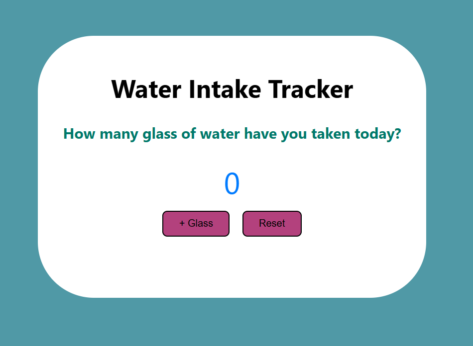
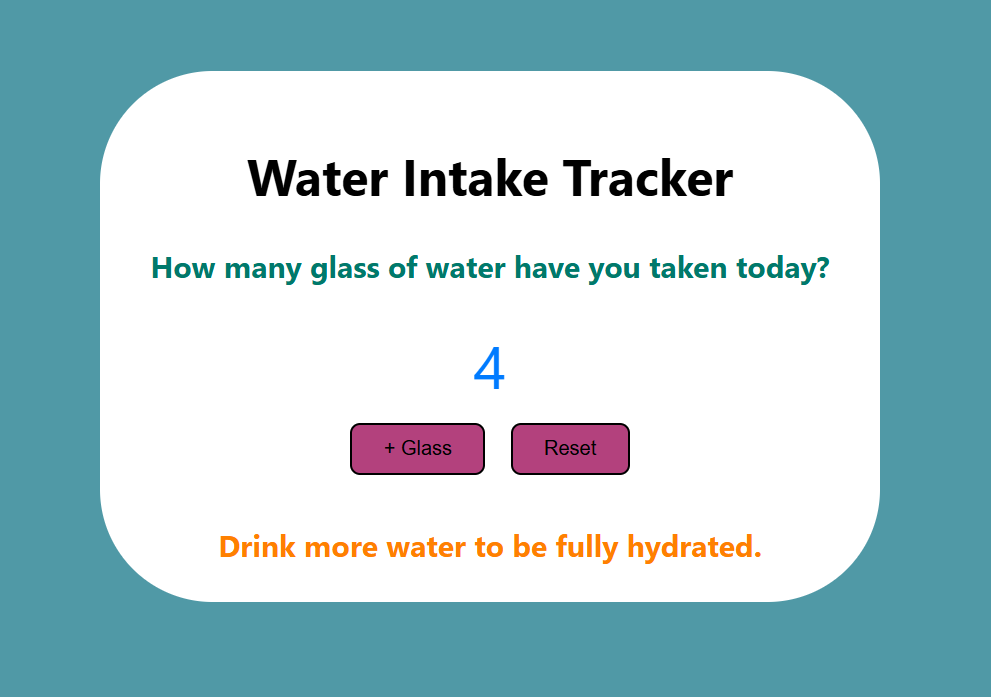
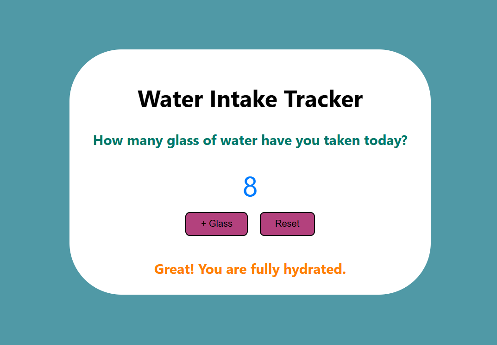
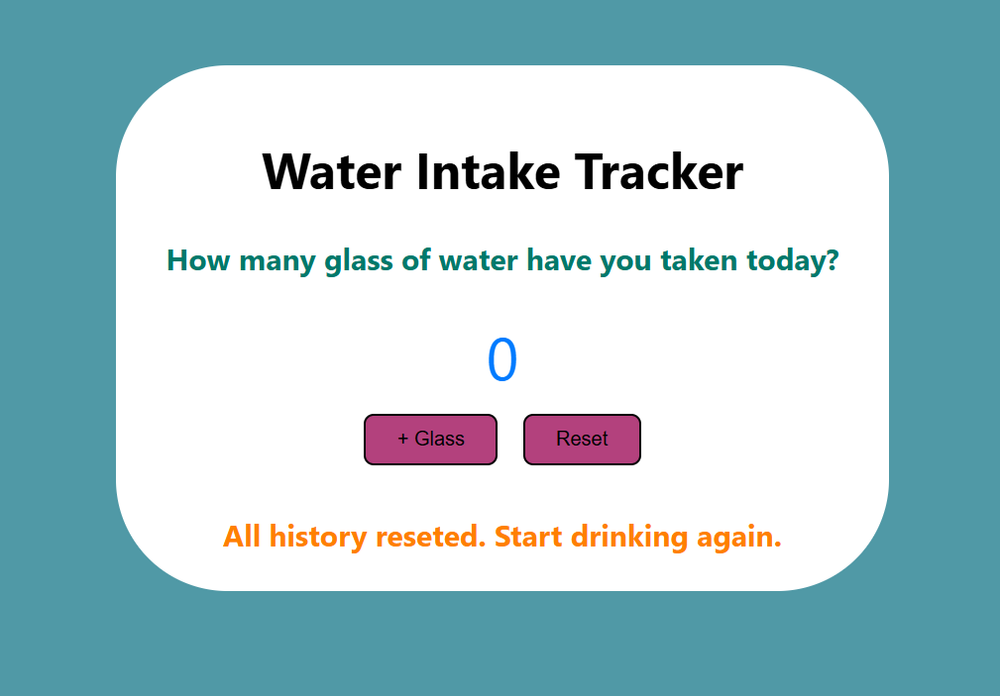

# Water Intake Tracker 💧

 

## Overview 🔍  
***Hey there! I’m Ashraful Alam from Chittagong, Bangladesh – a passionate software developer.***  
This is a **Water Intake Tracker** web app built using **HTML, CSS, and JavaScript**.  
It helps users track how many glasses of water they've had in a day, with motivational messages for hydration. The daily goal is 8 glasses. Simple and responsive design!

 

## 👨‍💻 Developer  
**Ashraful Alam**  
- Studying B.Sc. in Computer Science and Engineering  
- Institution: International Islamic University Chittagong (IIUC)  
- Duration: July, 2023 – Present  

 

## Features ✨  
- ✅ Add a glass of water with a single click  
- 🔄 Reset your progress any time  
- 🧠 Dynamic messages based on your hydration level  
- 📱 Fully responsive and minimal design  
- 🔐 No login, no data collection – Just you and your water goal!  

 

## How to Use 💡  
1. Click the **"+ Glass"** button each time you drink a glass of water  
2. The count will increase and show messages accordingly  
3. When you hit 8 glasses, you’ll get a congratulatory message  
4. Hit **Reset** if you want to start over  

 

## Languages & Tools Used 💻  
- HTML5  
- CSS3  
- JavaScript  

 

## Live Website 🌐  
👉 [Visit Live App](https://your-github-username.github.io/Water-Intake-Tracker)

 

## Screenshots 🖼️  

### ✅ Initial View   

### 💧 After Adding Glasses   

### 🎉 Fully Hydrated   

### 🔁 Reset State   

---

 

## Feedback  
If you liked it or want to suggest improvements, feel free to open an issue or email me directly.   

